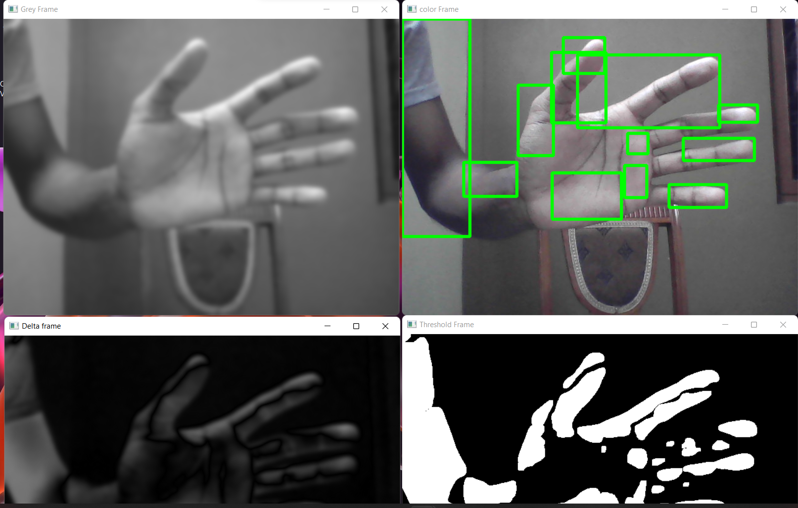
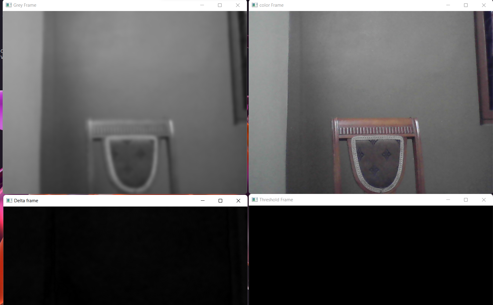
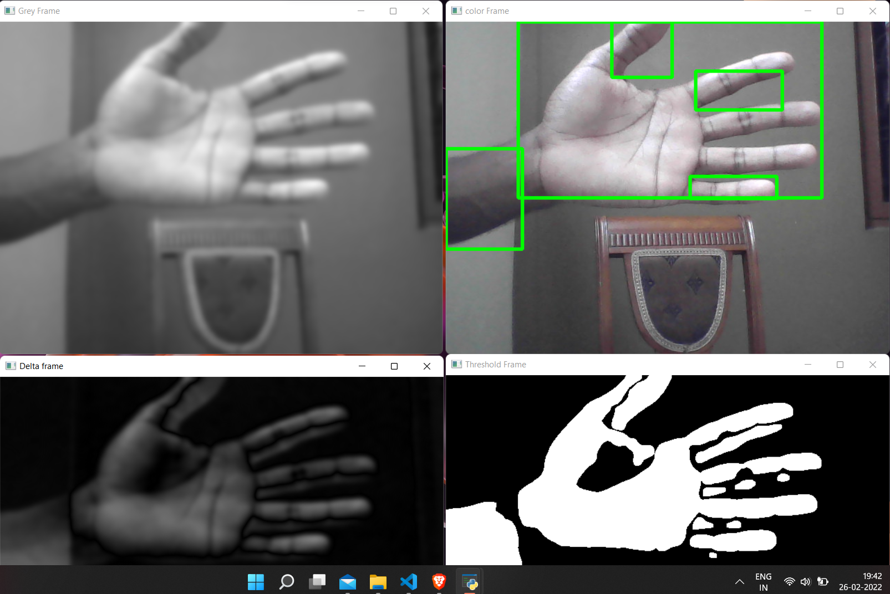

# Motion Detection

The goal of this project is to create a Motion Detection Program  by using **OpenCV** 



### Main features

* The program capture the motion where  time & date of motion automatically export into csv files onces the deployment closed by triggering/pressing  Q   button

* where the  second program take first program  data as input & produce a HTML Graphs by using  **Bokeh**



* The program use 4 frame to detect the motion (Color , Grey , Delta , Threshold)



## Folder directory of the Project
```
 📦Motion_Detection
 ┣ 📂Readme_files
 ┃ ┣ 📜in_motion.png
 ┃ ┣ 📜in_present_of_motion.png
 ┃ ┗ 📜no_motion.png
 ┣ 📂__pycache__
 ┃ ┗ 📜MotionDetection.cpython-39.pyc (data not inculded)
 ┣ 📜.gitignore
 ┣ 📜Graph.html (data not inculded)
 ┣ 📜LICENSE
 ┣ 📜MotionDetection.py
 ┣ 📜MotionDetectionGraphs.py
 ┣ 📜ReadMe.md
 ┗ 📜times.csv (data not inculded)          

```
Note:- Some of  file are only visible after  runing the development 
           


## Version(**Used while making project**) 

Python:
     
     Python 3.9.9
     
     
PIP :
   
     pip 21.2.4
     
     
Open CV:
     
     open cv 4.5.5 (Used in MotionDetection)

Pandas :

     pandas 1.3.5  (Used in MotionDetection)

Bokeh :
     
     bokeh 2.4.2   (Used in MotionDetectionGraphs)


## Install project dependencies:(**Ignore if you have following dependencies in you computer**)

Python:
     
     https://www.python.org/
     
     
PIP :
   
     python get-pip.py
     
     
Open CV:
     
     pip install opencv-python

pandas :
  
     pip install pandas

Bokeh :
 
     pip install bokeh

# Motion Dectection - Open CV

## Getting Started

First clone the repository from Github and switch to the new directory:

     git clone https://github.com/sa24449/Motion_Detection.git
     

Move to Project directory:

     cd Motion_Detection
      

You can now run the development :

     python MotionDetection.py


For  Generating Graphs of output :

     python MotionDetectionGraphs.py
     


